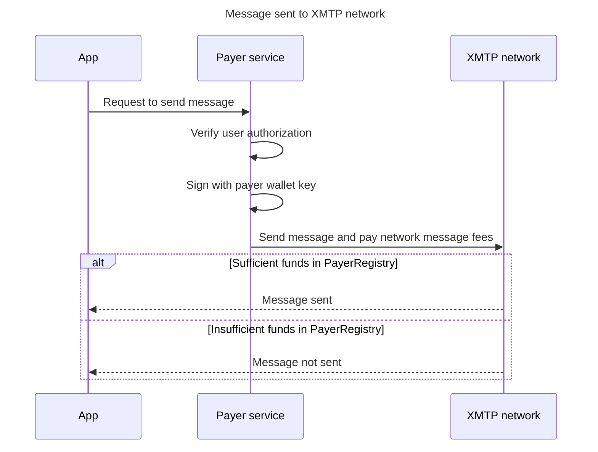
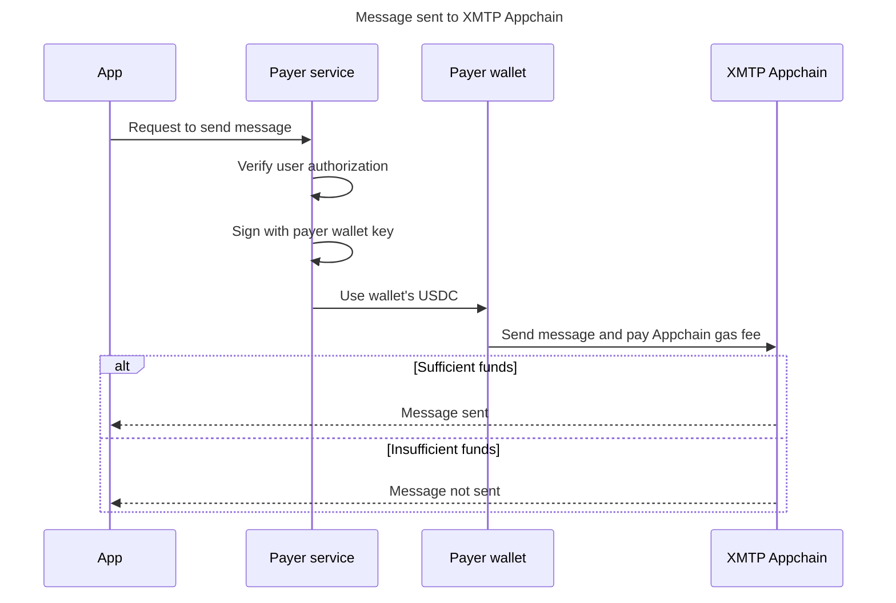

# Quickstart: Fund your app to send messages with XMTP

This is a quickstart guide to funding your app to send messages with XMTP.

## Step 1. Create a payer wallet

The payer wallet must be:

- A standard Ethereum-compatible wallet account
- Non-custodial, meaning you control the private key (not a third-party service)
- Able to sign and transact on the Base and XMTP Appchain networks
- Able to hold and transfer USDC tokens

You can create a payer wallet using common non-custodial wallet apps, such as Coinbase Wallet and MetaMask.

You'll need your payer wallet to register and fund it using the XMTP Payer Portal in the next step.

You'll need your payer wallet's private key when setting up your payer service in a subsequent step.

### Can I use a multisig?

Yes—Gnosis Safe or any ERC-1271 wallet can own a balance in the PayerRegistry and sign allowance approvals.

## Step 3. Register and fund a payer wallet

In this step, you’ll deposit USDC to the PayerRegistry smart contract and designate it for use by the payer wallet.

1. Go to the XMTP Payer Portal: [https://fund.xmtp.org/](http://fund.xmtp.org/).
2. Connect a wallet you want to use to fund your payer wallet. This can be the payer wallet itself or a different wallet.
3. Click **Deposit**.
4. Enter the amount of USDC you want to deposit. 
5. If you connected a wallet other than your payer wallet, select **Deposit to another address** and enter your payer wallet address. This option enables you to use any address to deposit funds designated for use by your payer wallet.
6. Click **Approve**.

### Who runs the XMTP Payer Portal?

[Ephemera](https://ephemerahq.com/) currently hosts the portal UI as a community service. Stewardship will move to DUNA and live on xmtp.org post-GA. The smart contracts are fully decentralized and non-custodial. 

### Can I switch wallets?

Disconnect the old wallet and connect a new one; your payer balances stay on-chain and can be managed by any wallet you control.

### Can I fund a payer from more than one wallet?

Any wallet can deposit USDC to the payer balance as long as it passes standard ERC-20 transfer rules. For shared budgets we recommend a multisig to centralize permissions.

## Step 4. Set up your payer service

A payer service is a small client that acts as a proxy between your app and your payer wallet, the XMTP network, and the XMTP Appchain.

You host your payer service on your infrastructure because it contains sensitive information, such as your payer wallet private key. The payer service uses this private key to sign transactions and pay fees from your payer wallet’s funds in the PayerRegistry and XMTP Appchain gas fees from your payer wallet.

The following sequence diagrams illustrate the payer service’s role in the following key flows.

**Flow for sending a message to the XMTP network**

**Flow for sending a message to the XMTP Appchain**

To learn more, see [Run a payer service](https://github.com/xmtp/docs-xmtp-org/blob/83728cdf6cad5b6dce740fa7c634d959f467172a/docs/pages/inboxes/payer-service.mdx).

## Step 5. Update your app to use a compatible XMTP SDK version

A compatible XMTP SDK version is one that supports payer helpers, enabling your app to communicate with your Payer Service.

- [Browser SDK >=vX.X](https://file+.vscode-resource.vscode-cdn.net/Users/jha/src/docs-xmtp-org/docs/pages/fund-your-app/quickstart.md#TODO)
- [Node SDK >=vX.X](https://file+.vscode-resource.vscode-cdn.net/Users/jha/src/docs-xmtp-org/docs/pages/fund-your-app/quickstart.md#TODO)
- [React Native SDK >=vX.X](https://file+.vscode-resource.vscode-cdn.net/Users/jha/src/docs-xmtp-org/docs/pages/fund-your-app/quickstart.md#TODO)
- [Kotlin SDK >=vX.X](https://file+.vscode-resource.vscode-cdn.net/Users/jha/src/docs-xmtp-org/docs/pages/fund-your-app/quickstart.md#TODO)
- [Swift SDK >=vX.X](https://file+.vscode-resource.vscode-cdn.net/Users/jha/src/docs-xmtp-org/docs/pages/fund-your-app/quickstart.md#TODO)

### Is there a testnet?

Yes—Base Sepolia, AppChain TestNet, and Broadcast Network TestNet all run identical contracts so you can dry-run funding and messaging.

### How do I get testnet funds?

Use the USDC faucet linked in the docs or DM @DevRel in Discord for bulk credits.

## Step 6. Send a test message and verify

Send a test message and view the XXXXXXXXXX dashboard in the XMTP Payer Portal to verify costs.

## Troubleshooting

- Signature rejected (MetaMask only) → If you see a **“Signature rejected”** error in MetaMask, it can sometimes be caused by a stuck or out-of-sync **nonce** (a number that keeps track of your transaction order).
    
    To fix this:
    
    1. Open MetaMask.
    2. Click your **account icon** in the top right.
    3. Go to **Settings → Advanced**.
    4. Click **Reset Account**. This does not affect your funds or wallet.
    
    If the issue persists:
    
    - Check for any stuck or pending transactions in your wallet.
    - Try sending a new transaction with a **custom nonce** if needed.
- Bridge pending > 15 min → Check Base status: [https://status.base.org/](https://status.base.org/)
- Message reverted: Check for `INSUFFICIENT_PAYER_BALANCE`
- Region restrictions: Automatic IP gate enforced for the following regions:
    
    Nodes in the `dev` and `production` XMTP network environments operate in US jurisdiction in compliance with Office of Foreign Assets Control (OFAC) sanctions and Committee on Foreign Investment in the United States (CFIUS) export compliance regulations. Accordingly, IP-based geoblocking is in place for the following countries/territories:
    
    - Cuba
    - Iran
    - North Korea
    - Syria
    - The Crimea, Donetsk People’s Republic, and Luhansk People’s Republic regions of Ukraine

---

## Step 3: Fund Your Account

### Setting Up Your Payment Wallet

XMTP accepts **USDC (USD Coin)** for all payments—a stable cryptocurrency pegged to the US dollar.

### Creating Your Payer Wallet

1. **Generate a dedicated wallet** for XMTP payments
2. **Store private key securely** (use environment variables/secrets management)
3. **Fund with USDC** via the Funding Portal
4. **Monitor balance** through your XMTP Gateway metrics

### How the Funding Portal Works

The Funding Portal simplifies blockchain complexity:

1. **You deposit USDC** into your Portal account
2. **Portal manages all payments** from your balance
3. **You monitor one balance** for all message costs

Behind the scenes, the Portal handles smart contract deposits, gas payments, and all blockchain interactions. You just see messages sent and USDC consumed.

### Flexible Funding Options

The Funding Portal supports various funding scenarios:

**Direct funding**: Fund your own apps directly
**Third-party funding**: Anyone can deposit funds on your behalf

- Investors can fund your startup's messaging costs
- Sponsors can cover costs for open-source projects
- Parent companies can fund subsidiary apps

**Managing others' funds**: You can also manage funds for other developers

- Fund multiple projects from one account
- Distribute investor funds to portfolio companies
- Manage messaging budgets across teams

> How it works: The Portal allows deposits to any wallet address. Whether you're funding yourself, being funded by others, or managing funds for a portfolio, the process is the same—deposit USDC to the target wallet through the Portal.
> 

### Acquiring USDC

- **Centralized exchanges**: Coinbase, Binance, Kraken
- **Direct purchase**: Circle, Coinbase
- **Business accounts**: Circle business accounts for larger operations

### Funding Timeline

- **July-September**: Test with testnet USDC only
- **October 7+**: Funding Portal accepts mainnet USDC deposits
- **November**: Fund wallet for production testing
- **Early December**: Ensure 3-6 months of operating funds

> Note: The Funding Portal will only accept testnet USDC until October 7. Plan your mainnet funding accordingly.
> 
